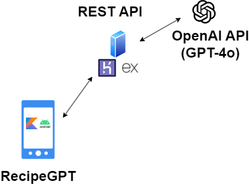

# RecipeGPT 📜🥗🧁
An Android app used for generating recipes by sending queries to OpenAI's GPT-4o model to process them and return recipes 🤤🍰.
It also shares with you cooking wisdom through its AI-generated quotes 🧠👩🏻‍🍳

## Usage

- The app allows you to save recipes on your phone, and also it allows you note what ingredients you have around or you're going to buy. This data is stored in a sort of ***inventory*** on the phone.

- All you have to do is open the app, search the type of food you want to cook like ***chocolate cake*** or ***caeser salad***. The app will display some results and you can click on the ***details*** button to open up a new page where you'll find the exact ingredients necessary and the steps for preparing the food.

- In the recipe details page, you will see that the quantities are mentioned next to them, if the number is in red that means that you do not have enough of that specific ingredient, while green means that you have enough. You will also be able to save the recipe on your phone so you can come back to it later or delete it if you so desire. You can also click on the ***cooked*** button which basically removes from your ***inventory*** the ingredients required by that recipe.

- From the recipe details page, you can also choose to set a recipe as ***listed***. This means that the app will add to the shopping list all the necessary ingredients and the quantities required by the recipe that you still don't have in your virtual ***inventory***.

- You can view the list of ingredients you need to buy, in order to be able to prepare all the recipes you have saved on your phone, and you can select the amount and quantity that you're buying or that you already have lying around.

- You can check your ***inventory*** by navigating to the ***ingredients*** page. There you can choose to edit or delete any of the saved ingredients.

- In preferences you have 2 settings, one which sets the frequency at which you receive random cooking quotes from the internet, the other one sets the number of recipes you want to generate on each request. The waiting time can be pretty big sometimes when generating recipes, so going for large numbers isn't going to work very well, since the server might throw a timeout exception.

# Architecture

### 1. Web Server 
- Built with ExpressJS, hosted on heroku. It sends prompts to OpenAI's gpt-4o to generate the recipes and it fetches them, then they get redirected to the app requesting them. Check out the repo by clicking [here](https://github.com/mmswflow-upb/recipe-provider-web-server.git).

- Why use it as an intermediary? Easier to make requests to OpenAI & Process responses as there's no SDK or library for android apps yet. Also the OpenAI API key is shared for all users, but it's saved securly and no one has access to it.

### 2. App Structure & Components Used
1. Activities - The app implements two activities, one called ***HomeActivity*** and the other ***RecipeDetailsActivity***. The ***HomeActivity*** contains 5 fragments that are reachable through the bottom navigation menu, they're grouped together in one activity because they do not focus on a single specific object. The ***RecipeDetailsActivity*** is started only when the user wants to view the details of a specific recipe.

2. Intents - Starting the ***RecipeDetailsActivity*** when clicking on the ***details*** button of a saved or generated recipe. Also when sharing recipes, an intent set with ***ACTION_SEND*** is used to let other apps know that we're going to share a recipe as plain text through them. They're also used when starting the background and foreground services mentioned below.

3. Notifications - The app displays persistent notifications while waiting for recipes to be fetched. It also displays normal notifications when fetching random cooking quotes from the remote server or when the remote server returns generated recipes.

4. Foreground Services - Displaying a persistent notification while waiting for the API to return generated recipes. It updates the elapsed time since the request has been made, which is shown in a persistent notification, and a final message when the results come in, or if an error occurs it displays the error message in the notification.

5. Database - App uses a ***ROOM*** database for storing recipes which are fetched from the external API, and stores available ingredients. 

6. Background Services - The app implements a service called ***DatabaseBackgroundService*** which is used for saving and fetching recipes or ingredients from the database, checking if the requirements for cooking a recipe are met, and removing from the DB the ingredients of a recipe when pressing on the ***cooked*** button. It also handles updating ingredients when users change amounts or units, and updating recipes when users list them or unlist them. It also manages very specific types of searches and deleting data.

7. Bound Services - The ***generateRecipesService*** is used to make requests to the API. It is bound to the ***HomeFragment*** when the view gets created. 

8. Shared Preferences - The app has two settings that are saved in ***SharedPreferences***. The frequency of fetching random cooking quotes and the number of recipes to be generated with each request. This is implemented using a utility class called ***SharedPreferencesManager***.

9. Broadcast Receivers - Whenever there's a change in the database, the ***DatabaseBackgroundService*** notifies all broadcast receivers about it, then the fragments linked to them have to update their UI accordingly. This ensures that data is synchronized across fragments. The ***SharedPreferencesManager*** also notifies a broadcast receiver linked to the ***HomeFragment*** whenever preferences are changed. This is because the ***HomeFragment*** needs to update the number of recipes it will request from the ***generateRecipesService***, and it must also enqueue the ***UniquePeriodWork*** with the ***WorkerManager*** that fetches random cooking quotes from the remote API. 

10. Usage of External APIs - The app fetches recipes and random cooking quotes from our own [custom-made web server](https://github.com/mmswflow-upb/recipe-provider-web-server.git) which is hosted online. We used ***Retrofit*** together with ***OkHttpClient*** to create an API client for sending requests to our remote web server.

11. ViewModels - They're used to improve the user's experience, for example when rotating the phone the content of the currently open page won't be reset to default, and requests to services are handled by the ViewModels.
